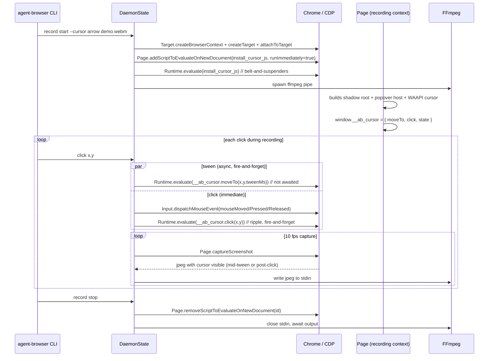

# feat: Synthetic animated cursor overlay during screen recording

## Summary

Inject a small in-page DOM overlay (top-layer Popover host + closed Shadow DOM + WAAPI-driven SVG cursor) when `record start` runs, drive its position via a JS controller exposed on `window`, and fire the cursor tween in parallel with each click so the recorded MP4/WebM shows a cursor that visibly travels between targets and pulses on click — without changing click timing on the page. Recording is the only target surface; the dashboard preview and normal browser sessions are unaffected.

---

## Problem Frame

`Page.captureScreenshot` (the source of every recorded frame in `cli/src/native/recording.rs`) renders only the page DOM — the OS cursor is never present. Recordings produced by `record start` therefore show a page that "operates itself" with no visible pointer, which makes demos, tutorials, and bug reproductions far less readable than they should be. The goal is a first-class, no-OS-required cursor that appears in the captured video and matches what a real user would see, without altering click timing or page state.

---

## Requirements

- R1. When `record start` runs with the cursor enabled, a visible cursor is baked into every captured frame from the moment the recording context loads through `record stop`.
- R2. The cursor's motion between targets is captured across multiple frames at 10 FPS — the tween dispatches in parallel with the click and continues animating during/after the CDP mouse events. (Replaces the earlier "tween must complete before click fires" framing — see Key Technical Decisions for rationale.)
- R3. Each click triggers a brief ripple/scale animation centered on the click point.
- R4. The overlay must not be observable to existing snapshot, accessibility, or selector-based interaction code paths (i.e., it doesn't appear in `snapshot.rs` output, `find_cursor_interactive_elements`, query/click-by-selector, or `aria` trees) — verified explicitly because closed Shadow DOM does not protect against CDP `DOM.getDocument({pierce:true})`.
- R5. The overlay must not intercept events (clicks must still hit the underlying page) and must survive same-document and cross-document navigations within the recording context.
- R6. The cursor is opt-in via a CLI flag on `record start`; default behaviour of `record start` remains identical to today (off).
- R7. A small built-in theme set (≥ 2 themes) is selectable via flag. No user-supplied SVG paths or theme JSON in v1.
- R8. Tween duration, click-animation duration, and cursor size are tunable via flags; sensible defaults are chosen so the typical user never needs to configure anything.
- R9. The feature compiles and runs on Chrome; non-Chrome engines (Lightpanda) skip cursor install. Documented as Chrome-only in v1.
- R10. Honors `prefers-reduced-motion` (host OS preference). When set, tween duration auto-clamps to 0 (cursor teleports), click ripple still fires (it's brief and informative). Configurable override via flag.

---

## Scope Boundaries

- v1 ships **recording-only** (chosen in planning).
- The dashboard live screencast keeps pointing at its current session by default (`set_cdp_session_id` is called only on `tab_new|tab_switch|tab_close|open|navigate` per `cli/src/native/actions.rs:1484` — `recording_start` is not in the list). However, if the user issues one of those actions *during* a recording, the dashboard screencast does follow into the recording context and would show the cursor. Documented as a known edge case in v1.
- No user-supplied SVG asset path. No external theme JSON/TOML bundle. Both intentionally deferred — see below.
- No keyboard/key-press visualization. Out of scope.
- No drag/scroll motion trail. Tween only applies to `click`, `dblclick`, and `hover`. Programmatic scrolling is not visualized.
- No mobile/touch indicator. When the recording context launches in a mobile viewport (`is_mobile == true` in the `state.viewport` tuple), cursor injection is skipped.

### Deferred to Follow-Up Work

- Live-screencast cursor rendering: the same JS asset can be reused; needs explicit `set_cdp_session_id` plumbing on the dashboard side and snapshot-exclusion hardening to land first.
- User-supplied SVG/theme JSON: revisit once the built-in set proves the API surface.
- Drag/scroll trails and key-press overlays: separate follow-ups, share the same overlay container.
- New-tab fan-out: if a recording opens additional pages, install the overlay on each via `Target.targetCreated`. Out of v1; documented as a known limit.

---

## Context & Research

### Relevant Code and Patterns

- **Recording lifecycle and ffmpeg pipe** — `cli/src/native/recording.rs` (frames sourced via `Page.captureScreenshot`, piped to ffmpeg at 10 FPS). No changes needed here; cursor is rendered into the page before capture, so it lands in frames "for free."
- **Recording context wiring and re-application of context-scoped CDP state** — `cli/src/native/actions.rs:4029` (`handle_recording_start`), `:4188` (`handle_recording_stop`), `:4199` (`handle_recording_restart`). Cursor scripts must be installed/removed alongside the existing download-behaviour and HTTPS-override re-application.
- **`Page.addScriptToEvaluateOnNewDocument` lifecycle helpers** — `cli/src/native/browser.rs:1372` (`add_script_to_evaluate`, returns identifier) and `:1389` (`remove_script_to_evaluate`). Drop-in fit; we'll extend the call site to also pass `runImmediately: true` (CDP parameter that runs the script on already-existing contexts as well, eliminating the about:blank race in newly-created targets).
- **Existing main-world script installation pattern** — `cli/src/native/react/mod.rs` and `cli/src/native/react/scripts.rs` (vendored `installHook.js` + `RENDERS_INIT` const + register-on-launch + Runtime.evaluate on current page). The cursor module mirrors this shape exactly.
- **Existing simpler page-overlay pattern** — `cli/src/native/screenshot.rs` injects a `<div id="__agent_browser_annotations__">` via inline `cssText`, no Shadow DOM. Acceptable precedent for "we own this DOM region"; the cursor module deliberately upgrades to Shadow DOM + popover for stricter isolation and CSP safety.
- **CDP click pipeline (where the tween must hook in)** — `cli/src/native/interaction.rs:887` (`dispatch_click`: `mouseMoved` → `mousePressed` → `mouseReleased`). Only three top-level entry points reach a real `Input.dispatchMouseEvent`:
  - `click` — `cli/src/native/interaction.rs:9`
  - `dblclick` — `cli/src/native/interaction.rs:29` (delegates to `click` with `click_count = 2`)
  - `hover` — `cli/src/native/interaction.rs:48` (dispatches `mouseMoved` directly)
- **Snapshot's existing "cursor interactive" detector** — `cli/src/native/snapshot.rs:609` (`find_cursor_interactive_elements`). Filters on `getComputedStyle(el).cursor === 'pointer'` and onclick/tabindex.
- **Snapshot piercing surface (must audit)** — `snapshot.rs` may call `DOM.getDocument({pierce:true})` and/or `Accessibility.getFullAXTree`, both of which **do** see into closed shadow roots ([CDP behavior](https://chromedevtools.github.io/devtools-protocol/tot/DOM/#method-getDocument)). Closed Shadow DOM is not sufficient on its own for R4 — we also need `aria-hidden="true"` + `role="presentation"` on the host AND an explicit allow-list/skip in any pierce-true snapshot path.
- **`DaemonState` definition and field placement** — `cli/src/native/actions.rs:202` (NOT `state.rs`). Existing peer fields like `recording_state`, `tracing_state` (`:213–214`), `engine: String` (`:257`), and `viewport: Option<(i32, i32, f64, bool)>` (`:262`) live alongside what we'll add (`cursor_overlay: Option<CursorOverlayConfig>`, `cursor_script_id: Option<String>`).
- **Engine identifier** — `state.engine: String`, populated from `AGENT_BROWSER_ENGINE` env (`actions.rs:311`), default `"chrome"`. Use `state.engine == "chrome"` to gate cursor install.
- **Stream-server scope plumbing** — `cli/src/native/stream/mod.rs:98` (`set_cdp_session_id`) is called from `actions.rs:539` (`update_browser`) and `:1488` (only for `tab_new|tab_switch|tab_close|open|navigate`). `set_recording` (`stream/mod.rs:137`) only flips a flag. This confirms the dashboard does not follow into the recording context unless the user navigates during recording.
- **`Runtime.evaluate` with `awaitPromise`** — used via `EvaluateParams` struct + `send_command_typed`. Examples: `actions.rs:3257`, `:5442`; `browser.rs:770`. Pattern is `EvaluateParams { expression, return_by_value: Some(true), await_promise: Some(true), .. }`. The `timeout` parameter is opt-in (CDP has no default); callers set it manually when they want bounded waits.
- **CLI flag conventions and recording subcommand parser** — `cli/src/commands.rs:1393` (`record` subcommand). Parser is positional/whitespace-split; only fully boolean flags (`--headless`) and value-required flags (`--foo <bar>`) exist today. `--cursor[=value]` (optional-value style) is **not** supported by the existing parser — v1 uses `--cursor <theme>` (separate token) instead.
- **Doc surfaces** (per AGENTS.md) — `cli/src/output.rs:2280` (record help block), `README.md` (Options table), `skill-data/core/SKILL.md`, `skill-data/core/references/video-recording.md` (already exists; append cursor section here), `docs/src/app/` MDX page for record (HTML `<table>` per AGENTS.md).

### Institutional Learnings

- `docs/solutions/` does not exist in this repo; AGENTS.md is the authoritative compounded guidance.
- AGENTS.md guidance honored by this plan: kebab-case flags, no emojis in code/docs, 5-surface doc fanout, MDX uses `<table>` not pipe tables, no native browser dialogs (no dashboard work in v1).

### External References

- **CSP behavior** — `el.style.foo = 'bar'` and `adoptedStyleSheets` (constructable `CSSStyleSheet`) are not subject to `style-src`. `<style>` blocks, `el.setAttribute('style', ...)`, and `el.style.cssText = ...` ARE. We use the safe forms exclusively. ([MDN CSP style-src](https://developer.mozilla.org/en-US/docs/Web/HTTP/Reference/Headers/Content-Security-Policy/style-src), [WICG construct-stylesheets #98](https://github.com/WICG/construct-stylesheets/issues/98)).
- **`Page.addScriptToEvaluateOnNewDocument`** runs in main world by default. `worldName` creates an isolated world per frame (page CSP doesn't apply to script execution there, but DOM nodes still live in the shared DOM). `runImmediately: true` (boolean param) runs the script on existing contexts as well — recommended when registering against a freshly-created target whose `about:blank` may already be loaded ([CDP Page docs](https://chromedevtools.github.io/devtools-protocol/tot/Page/#method-addScriptToEvaluateOnNewDocument)).
- **`Runtime.evaluate` with `awaitPromise: true`** has no default timeout. Pass `timeout: tween_ms + 1000` defensively; on context destruction CDP returns `"Promise was collected"` / `"Execution context was destroyed"`, which we swallow as Ok(()) ([CDP Runtime docs](https://chromedevtools.github.io/devtools-protocol/tot/Runtime/#method-evaluate)).
- **Closed Shadow DOM** is opaque to page-side `document.querySelectorAll` and `element.shadowRoot`, but **`DOM.getDocument({pierce:true})` and `Accessibility.getFullAXTree` see through it** ([Yotam, "Piercing the Shadow Root Using CDP"](https://yotam.net/posts/piercing-the-shadow-root-using-cdp/)).
- **Top-layer paint order** — Popover API and `<dialog>.showModal()` paint above any z-index, including each other (last opened wins) ([Chrome top layer blog](https://developer.chrome.com/blog/what-is-the-top-layer)). Required to survive pages that themselves use modals/popovers.
- **WAAPI** (`Element.animate`) is composited where possible, returns `animation.finished` Promise, supports `animation.cancel()` for mid-flight retarget. Cleaner than `requestAnimationFrame` for our use case ([MDN Web Animations API](https://developer.mozilla.org/en-US/docs/Web/API/Web_Animations_API)).
- **Lightpanda CDP support** is in beta (~95% Puppeteer/Playwright drop-in) but lacks a public method-level matrix. v1 stance: detect via `state.engine` and skip; don't attempt graceful degradation.
- **Prior art** — Playwright's `recordVideo` does NOT show a cursor (long-standing feature request, Playwright #1374); rrweb renders cursor on replay only, not in live recording; `puppeteer/test/assets/input/mouse-helper.js` is the canonical reference (plain `<div>`, no Shadow DOM, no CSP handling, no navigation persistence — debug-only). This plan is more rigorous than any existing reference.

---

## Key Technical Decisions

- **In-page DOM overlay rather than CDP-side overlay or ffmpeg compositing.** The recording pipeline reads JPEGs out of `Page.captureScreenshot`. Rendering the cursor inside the page means it's already part of the frame at capture time — zero per-frame decode/encode overhead, no new image dependency, no risk of cursor drift versus page repaints. CDP's `Overlay` domain has no animation primitives and is entangled with DevTools state (rejected). ffmpeg-side compositing requires per-frame JPEG decode, position synchronization in Rust, and doubles the work the recording loop does (rejected).
- **Top-layer Popover host (`popover="manual"` + `showPopover()`), not a fixed-position div with max z-index.** The popover paints in the top layer above all non-top-layer content regardless of page z-index, including pages that themselves open `<dialog>` modals (`<dialog>.showModal()` and popovers stack in the top layer in opening order — we re-show on `MutationObserver` if needed). Falls back gracefully on browsers without Popover support: `host.showPopover` is a function check, then degrades to `position: fixed` + max z-index.
- **Closed Shadow DOM attached to `documentElement`, plus snapshot-pierce defense.** Shadow root isolates styles from the page. But because CDP can pierce, we additionally:
  1. Mark the host with `aria-hidden="true"` and `role="presentation"`.
  2. Use a stable, identifiable host id (`__ab_cursor_root__`) so snapshot code paths that pierce can skip the subtree explicitly.
  3. Audit `cli/src/native/snapshot.rs` for `pierce: true` calls in U3 and add an id-skip if any are found.
- **JS-applied styles via constructable `CSSStyleSheet` + per-property `el.style.x =` — never `cssText`/`setAttribute('style', ...)`/`<style>`.** Only the constructable-sheet and per-property-assignment paths bypass `style-src` CSP. Documented constraint in U1 implementation.
- **Async tween: fire-and-forget alongside the click; do not block `dispatch_click`.** This is the v1 default (and a change from the earlier wait-for-tween proposal). At 10 FPS / 100 ms per frame, even a 250 ms tween captures over ~3 frames; firing the tween at the start of `dispatch_click` and not awaiting it means the cursor visibly arrives during/after the click — matches how real users perceive their own pointer (it doesn't pause for the OS to process the click). Crucially, this preserves click-pipeline timing for non-recording automation that may share `dispatch_click` (no Heisenbug from a 250 ms delay during recording-only). An opt-in `--cursor-block-clicks` flag is provided for users who want strict visual fidelity at the cost of latency.
- **Cursor state lives in the page (`window.__ab_cursor.state.x/y`), not in Rust.** Simpler ownership, survives across CDP round-trips, naturally resets on navigation.
- **Built-in themes only in v1.** SVG strings are `&'static str` consts. No file I/O, no path-resolution surface.
- **WAAPI (`Element.animate`) for the tween; not `requestAnimationFrame`.** Composited where possible, returns `animation.finished` Promise (clean cancel/retarget), one fewer state machine.
- **`Page.addScriptToEvaluateOnNewDocument` with `runImmediately: true` + best-effort `Runtime.evaluate` on current page.** The `runImmediately` parameter handles the about:blank race in freshly-created recording targets; the explicit `Runtime.evaluate` is belt-and-suspenders.
- **Skip on mobile viewport.** Detect via `state.viewport.map(|(_, _, _, is_mobile)| is_mobile)`, log info, no cursor.
- **Skip on non-Chrome engines.** `state.engine != "chrome"` short-circuits install.
- **Symbol-keyed global to reduce collisions with content scripts.** Use a deduplication guard like `if (window[Symbol.for('__ab_cursor__')]) return;` plus a public `window.__ab_cursor` for the controller surface (Symbol is the install guard; the controller is still discoverable from Rust via the named global).

---

## Open Questions

### Resolved During Planning

- **Sync model**: async tween, do not block `dispatch_click`. Opt-in synchronous via `--cursor-block-clicks`.
- **Host model**: top-layer popover with closed Shadow DOM, attached to `documentElement`.
- **Animation API**: WAAPI (`Element.animate`), not RAF.
- **Themes**: `arrow` (default), `dot`, `hand`. Static SVG.
- **Where is `DaemonState`?** `cli/src/native/actions.rs:202`.
- **How is mobile detected?** `state.viewport` tuple's 4th element (`is_mobile: bool`).
- **How is engine detected?** `state.engine == "chrome"`.
- **Does the dashboard screencast follow into the recording context?** No, by default. Yes, if the user issues `tab_new|tab_switch|tab_close|open|navigate` during recording (`actions.rs:1484`). Documented as a v1 limit.
- **CLI flag form**: `--cursor <theme>` (separate token) — `--cursor[=theme]` requires a parser refactor we don't want for v1.
- **`Runtime.evaluate` timeouts**: pass `timeout: tween_ms + 1000`. Swallow `"Promise was collected"` and `"Execution context was destroyed"` as `Ok(())`.
- **`prefers-reduced-motion`**: detected page-side via `window.matchMedia('(prefers-reduced-motion: reduce)').matches`; auto-zeros tween duration; `--cursor-motion always|auto|off` flag overrides.

### Deferred to Implementation

- **Exact easing curve**: cubic-out vs ease-in-out. Pick during U1 by recording 2–3 short clips.
- **Optional cursor pulse on `dispatchKeyEvent`**: nice touch; decide once tween infra lands.
- **Whether `find_cursor_interactive_elements` needs a defensive id-skip**: only if the snapshot audit in U3 shows the overlay leaking despite Shadow DOM + popover + `aria-hidden`. Pre-emptive skipping is avoided (couples snapshot logic to an internal name).

---

## High-Level Technical Design

> *This illustrates the intended approach and is directional guidance for review, not implementation specification. The implementing agent should treat it as context, not code to reproduce.*

### Lifecycle (Mermaid)



### Page-side controller shape (pseudo-code, WAAPI + popover)

```js
// Installed via Page.addScriptToEvaluateOnNewDocument(runImmediately: true)
(() => {
  const GUARD = Symbol.for('__ab_cursor__');
  if (window[GUARD]) return;
  if (window.self !== window.top) return;          // top-frame only
  window[GUARD] = true;

  const HOST_ID = '__ab_cursor_root__';
  const cfg = window.__ab_cursor_config || { tweenMs: 250, clickMs: 150, size: 28, svg: '...' };

  // Honor host OS preference; can be overridden by cfg.motion === 'always'
  const reducedMotion = window.matchMedia('(prefers-reduced-motion: reduce)').matches;
  const tweenDefault = (cfg.motion === 'always' || !reducedMotion) ? cfg.tweenMs : 0;

  const host = document.createElement('div');
  host.id = HOST_ID;
  host.setAttribute('aria-hidden', 'true');
  host.setAttribute('role', 'presentation');
  host.style.position = 'fixed';
  host.style.inset = '0';
  host.style.pointerEvents = 'none';
  host.style.zIndex = '2147483647';                // fallback if popover not supported
  host.style.background = 'transparent';
  if ('popover' in HTMLElement.prototype) {
    host.popover = 'manual';
  }

  const shadow = host.attachShadow({ mode: 'closed' });
  const sheet = new CSSStyleSheet();
  sheet.replaceSync(/* programmatic CSS, see U1 */);
  shadow.adoptedStyleSheets = [sheet];

  // Build cursor + ripple nodes (per-property style assignments only)
  // ...

  document.documentElement.appendChild(host);
  if (host.showPopover) {
    try { host.showPopover(); } catch {}
    // Re-promote if a page modal preempts us.
    new MutationObserver(() => {
      if (host.isConnected && host.showPopover && !host.matches(':popover-open')) {
        try { host.showPopover(); } catch {}
      }
    }).observe(document.documentElement, { childList: true, subtree: false });
  }

  const state = { x: -1000, y: -1000, animation: null };

  function moveTo(x, y, ms) {
    const duration = Math.max(0, ms ?? tweenDefault);
    const fromX = state.x, fromY = state.y;
    if (duration === 0 || fromX < 0) {
      state.x = x; state.y = y; applyTransform();
      return Promise.resolve();
    }
    if (state.animation) state.animation.cancel();
    state.x = x; state.y = y;                       // commit final position immediately
    const anim = cursorEl.animate(
      [{ transform: `translate(${fromX}px, ${fromY}px)` },
       { transform: `translate(${x}px, ${y}px)` }],
      { duration, easing: 'cubic-bezier(0.22, 1, 0.36, 1)', fill: 'forwards' }
    );
    state.animation = anim;
    return anim.finished.catch(() => {});           // swallow cancel rejections
  }

  function click(x, y) {
    rippleEl.animate(
      [{ transform: `translate(${x}px, ${y}px) scale(0)`, opacity: 0.6 },
       { transform: `translate(${x}px, ${y}px) scale(2.2)`, opacity: 0 }],
      { duration: cfg.clickMs, easing: 'ease-out', fill: 'forwards' }
    );
  }

  function destroy() {
    state.animation?.cancel();
    host.remove();
    delete window[GUARD];
    delete window.__ab_cursor;
  }

  window.__ab_cursor = { moveTo, click, destroy, state };
})();
```

The Rust side calls `Runtime.evaluate({ expression: "window.__ab_cursor && window.__ab_cursor.moveTo(x, y, ms)", awaitPromise: false, timeout: tweenMs + 1000 })` for the tween (no await — async behaviour), and a similar fire-and-forget call for `click`.

### Decision matrix: when does the overlay touch the page?

| Trigger                  | Page-side action                                              | Blocks Rust?                |
|--------------------------|---------------------------------------------------------------|-----------------------------|
| `record start`           | install script (new-doc + immediate eval)                     | ~10 ms (negligible)         |
| Any same-context navigation | new-doc script auto-runs, rebuilds host                    | none                        |
| New tab opens (`Target.targetCreated`) | not handled in v1; new tab has no overlay         | n/a (documented limit)      |
| `dispatch_click`         | `moveTo(x, y, ms)` fire-and-forget; `click(x, y)` after press | no (default), opt-in yes via `--cursor-block-clicks` |
| Hover / move helper      | `moveTo(x, y, ms)` fire-and-forget                            | no                          |
| `record stop` / restart  | `Page.removeScriptToEvaluateOnNewDocument` + best-effort `__ab_cursor.destroy()` | none |
| Snapshot, accessibility  | host carries `aria-hidden`, `role="presentation"`, `id="__ab_cursor_root__"` for explicit skip in pierce-true paths | n/a |

---

## Implementation Units

### U1. Cursor overlay JS asset module (themes, controller, install script)

**Goal:** Produce a single Rust module that exposes the JS source string used to install the in-page overlay, parameterized by theme + size + tween/click durations + motion mode. Mirrors the `cli/src/native/react/scripts.rs` pattern.

**Requirements:** R1, R3, R7, R10

**Dependencies:** none

**Files:**
- Create: `cli/src/native/cursor_overlay/mod.rs`
- Create: `cli/src/native/cursor_overlay/scripts.rs`
- Create: `cli/src/native/cursor_overlay/cursor.js`
- Create: `cli/src/native/cursor_overlay/themes/arrow.svg`
- Create: `cli/src/native/cursor_overlay/themes/dot.svg`
- Create: `cli/src/native/cursor_overlay/themes/hand.svg`
- Test: `cli/src/native/cursor_overlay/mod.rs` (`#[cfg(test)] mod tests`)

**Approach:**
- `cursor.js` is the controller (top-layer popover host, closed shadow root, `__ab_cursor` global, WAAPI tween, `prefers-reduced-motion` honoring). Reads `window.__ab_cursor_config`.
- `scripts.rs` exposes `pub fn build_install_script(theme: Theme, size: u32, tween_ms: u32, click_ms: u32, motion: MotionMode) -> String` that prepends a config initializer (`window.__ab_cursor_config = { size, tweenMs, clickMs, motion, svg: "<svg .../>" };`) to the controller source.
- SVG strings are `include_str!("themes/<name>.svg")` consts.
- `pub enum Theme { Arrow, Dot, Hand }`, `Theme::default() = Arrow`, plus `from_str` (case-insensitive). `pub enum MotionMode { Auto, Always, Off }`, default `Auto`.
- Symbol-keyed install guard (`Symbol.for('__ab_cursor__')`) to reduce collisions with content scripts.
- Constructable `CSSStyleSheet` + `adoptedStyleSheets`; per-property `el.style.x = ...` only — never `cssText`/`<style>`/`setAttribute('style', ...)`.
- WAAPI animations only.

**Patterns to follow:**
- `cli/src/native/react/mod.rs` (module exposes `INSTALL_HOOK_JS` const sourced via `include_str!`)
- `cli/src/native/react/scripts.rs` (`pub const ... = r#"..."#;` for JS source bodies)

**Test scenarios:**
- Happy path: `build_install_script(Theme::Arrow, 28, 250, 150, MotionMode::Auto)` returns a string containing the configured size, tween duration, motion mode, and arrow SVG.
- Happy path: `Theme::from_str("dot")` returns `Theme::Dot`; `Theme::from_str("Arrow")` is case-insensitive; `MotionMode::from_str("always")` returns `Always`.
- Edge case: `Theme::from_str("")` returns the default theme.
- Error path: `Theme::from_str("rainbow")` returns an error variant carrying the unknown name.
- Edge case: `tween_ms=0` produces a script that compiles as JS (smoke-checked via a JSON wrapper).
- Edge case: each theme SVG is non-empty and contains `<svg`.
- Anti-CSP: source string contains no `<style` substring, no `cssText`, no `setAttribute('style'` — guards against accidental regressions.
- Anti-emoji (AGENTS.md): source string contains no glyph characters in U+1F300–U+1FAFF (regex check).

**Verification:**
- `cargo test cursor_overlay` passes.
- Manual: `agent-browser record start /tmp/x.webm --cursor arrow` then opening DevTools shows `#__ab_cursor_root__` on `<html>` and `window.__ab_cursor` defined.

---

### U2. Rust controller for the overlay (install/remove + bridge calls)

**Goal:** Provide a small Rust API that installs and removes the overlay script on a given session, and that drives the page-side `moveTo`/`click` from Rust.

**Requirements:** R1, R2, R5, R10

**Dependencies:** U1

**Files:**
- Create: `cli/src/native/cursor_overlay/controller.rs`
- Modify: `cli/src/native/cursor_overlay/mod.rs` (re-exports + `CursorOverlayConfig`)
- Modify: `cli/src/native/actions.rs` (add `cursor_overlay: Option<CursorOverlayConfig>` and `cursor_script_id: Option<String>` fields to `DaemonState` near `:213`)
- Test: `cli/src/native/cursor_overlay/controller.rs` (`#[cfg(test)] mod tests`)

**Approach:**
- `CursorOverlayConfig { theme, size_px, tween_ms, click_ms, motion, block_clicks }` — plain struct, derived `Default`.
- `pub async fn install(client: &CdpClient, session_id: &str, config: &CursorOverlayConfig) -> Result<String, String>`:
  1. Build the install script via `scripts::build_install_script`.
  2. Call `Page.addScriptToEvaluateOnNewDocument` with `{ source, runImmediately: true }`. Record the identifier.
  3. Belt-and-suspenders: `Runtime.evaluate` the same source on the current page so the overlay appears immediately.
  4. Return the identifier.
- `pub async fn remove(client: &CdpClient, session_id: &str, identifier: &str) -> Result<(), String>`:
  1. Call `Page.removeScriptToEvaluateOnNewDocument`.
  2. Best-effort `Runtime.evaluate` of `window.__ab_cursor && window.__ab_cursor.destroy()`. Errors logged at debug, not propagated.
- `pub async fn move_async(client: &CdpClient, session_id: &str, x: f64, y: f64, tween_ms: u32) -> Result<(), String>`:
  - `Runtime.evaluate` with `awaitPromise: false`, `timeout: tween_ms + 1000`, expression `window.__ab_cursor && window.__ab_cursor.moveTo(x, y, tween_ms)`. Fire-and-forget by design.
- `pub async fn move_blocking(client: &CdpClient, session_id: &str, x: f64, y: f64, tween_ms: u32) -> Result<(), String>`:
  - Same as above but `awaitPromise: true`. Used only when `--cursor-block-clicks` is set.
- `pub async fn click_pulse(client: &CdpClient, session_id: &str, x: f64, y: f64) -> Result<(), String>`:
  - Fire-and-forget `Runtime.evaluate` of `__ab_cursor.click(x, y)`.
- All four bridge functions swallow the following CDP error strings as `Ok(())`: `"Promise was collected"`, `"Execution context was destroyed"`, `"Cannot find context"`, missing-`__ab_cursor` (script not yet installed on a brand-new context). All propagate `"Target closed"` and `"not found"` as today.

**Patterns to follow:**
- `cli/src/native/browser.rs:1372` (`add_script_to_evaluate` / `remove_script_to_evaluate`) — extend the existing helper or call `Page.addScriptToEvaluateOnNewDocument` directly with the new `runImmediately` parameter.
- `cli/src/native/actions.rs:3257` and `:5442` for `EvaluateParams { expression, return_by_value, await_promise, .. }` shape.
- `cli/src/native/actions.rs:202–290` for adding new fields to `DaemonState`.

**Test scenarios:**
- Happy path: `CursorOverlayConfig::default()` produces an install script that contains `size`, `tweenMs`, `clickMs`, `motion`, and `svg`.
- Edge case: `move_async` produces an `EvaluateParams` payload with `await_promise: Some(false)` and `timeout: Some(tween_ms + 1000)`.
- Edge case: `move_blocking` produces `await_promise: Some(true)`.
- Error path: when CDP returns `"Promise was collected"`, `move_async`/`move_blocking` return `Ok(())`.
- Error path: when CDP returns `"Target closed"`, the function propagates the error (matches recording loop semantics).
- Error path: when CDP returns `"undefined"` (no `__ab_cursor`), function returns `Ok(())` — page is mid-navigation.

**Verification:**
- Unit tests pass.
- Manual: install creates the host element; remove deletes it; sequence of `move_async` calls visibly tweens without blocking.

---

### U3. Recording lifecycle integration + snapshot pierce audit

**Goal:** Install on `record start`, remove on `record stop`, re-install correctly on `record restart`. Audit `snapshot.rs` for `pierce: true` paths and skip the cursor host id if any are present.

**Requirements:** R1, R4, R5, R9

**Dependencies:** U2

**Files:**
- Modify: `cli/src/native/actions.rs` (`handle_recording_start` at `:4029`, `handle_recording_stop` at `:4188`, `handle_recording_restart` at `:4199`; add fields on `DaemonState` near `:213`)
- Modify: `cli/src/native/snapshot.rs` (only if audit shows a pierce-true call; add a guard that skips nodes with `id == "__ab_cursor_root__"` from output)

**Approach:**
- After the new context is created and navigation completes (around `actions.rs:4173`) and *before* `state.start_recording_task(...)` (`:4179`), if `state.cursor_overlay.is_some()` and `state.engine == "chrome"` and the viewport is not mobile (`state.viewport.map(|(_, _, _, is_mobile)| !is_mobile).unwrap_or(true)`), call `cursor_overlay::install(...)`. Save returned id into `state.cursor_script_id`.
- `recording_stop` (`:4188`) calls `cursor_overlay::remove` if `cursor_script_id` is set, then clears it. Failures logged.
- `recording_restart` (`:4199`): the existing implementation at `:4205–4213` re-uses `browser.active_session_id()` (no new context). The cursor script id from the previous run is still live on that same session. **Bug class: double-mount.** Fix: `remove` the previous script (if any) before `install`, or check `window.__ab_cursor` page-side and short-circuit. Implement the explicit remove-then-install path; clear `cursor_script_id` first.
- On mobile viewport: skip install, log info, leave `cursor_script_id = None`.
- On non-Chrome engine: skip install with a single info log (`"cursor overlay disabled on engine={}"`).
- Snapshot pierce audit:
  - Search `snapshot.rs` for `pierce`, `getDocument`, and `getFullAXTree` callsites.
  - For each pierce-true path, add a filter that skips any node whose `attributes` contain `id == "__ab_cursor_root__"` along with its subtree.
  - Document the audit outcome in the unit's verification field (find/no-find both acceptable; both must be tested).

**Patterns to follow:**
- The "re-apply context-scoped state to the new context" block at `actions.rs:4098–4144` (download behaviour, HTTPS overrides, cookies) — cursor install belongs in the same neighbourhood.
- Existing snapshot filters that drop nodes by id/attribute.

**Test scenarios:**
- Happy path: `handle_recording_start` with cursor config sets `state.cursor_script_id` to a non-empty string.
- Happy path: `handle_recording_stop` clears `state.cursor_script_id` to `None` even if remove returns an error.
- Edge case: `handle_recording_start` with no cursor config records a frame whose page contains no `#__ab_cursor_root__` element.
- Edge case: mobile viewport plus cursor config → skipped, info-logged, `cursor_script_id` stays `None`.
- Edge case: non-Chrome engine plus cursor config → skipped, info-logged.
- Integration: `record start` → `record restart` → snapshot the page → `__ab_cursor` is present and not duplicated (no double-mount). Inspect via `Runtime.evaluate("document.querySelectorAll('#__ab_cursor_root__').length")` returns `1`.
- Integration: snapshot taken during recording is identical (modulo whitespace) to the same fixture without recording — proves the pierce-audit fix works.
- Error path: if `Page.addScriptToEvaluateOnNewDocument` returns an error, `cursor_script_id` stays `None` and recording proceeds without cursor (graceful degradation; logged at warn).

**Verification:**
- After `record start`, `Runtime.evaluate("typeof window.__ab_cursor")` returns `"object"`.
- After `record stop`, the same expression returns `"undefined"`.
- After `record restart`, `document.querySelectorAll('#__ab_cursor_root__').length === 1`.
- During recording, an agent-browser `snapshot` against the fixture page produces output byte-identical (modulo timestamps) to a snapshot of the same page in a non-recording session.

---

### U4. Async tween hook in the click/move pipeline

**Goal:** When a cursor overlay is active, `dispatch_click`/`hover` fire a fire-and-forget tween call alongside the real CDP mouse events. Default behaviour adds zero blocking time. Optional `--cursor-block-clicks` makes the tween synchronous for users who want strict visual fidelity.

**Requirements:** R2, R3

**Dependencies:** U2, U3

**Files:**
- Modify: `cli/src/native/interaction.rs` (`dispatch_click` at `:887`; `hover` at `:48`)

**Approach:**
- Helper `maybe_animate_cursor_async(state, client, session_id, x, y) -> Result<(), String>`: no-op unless `cursor_script_id.is_some()`. When active, calls `cursor_overlay::move_async`. Bridge errors are best-effort `Ok(())` — never propagate.
- In `dispatch_click`: call the helper at the very top (kicks off the tween), then run the existing `mouseMoved/Pressed/Released` sequence unchanged, then call `cursor_overlay::click_pulse` after the press dispatch.
- In `hover`: call the helper just before the existing `mouseMoved` dispatch. No click pulse on hover.
- `--cursor-block-clicks`: if `state.cursor_overlay.as_ref().map(|c| c.block_clicks).unwrap_or(false)`, swap `move_async` for `move_blocking` in the click path only (hover stays async — blocking on hover would create UX-relevant latency without a corresponding visual benefit).
- The synchronous path uses `Runtime.evaluate` with `awaitPromise: true` and `timeout: tween_ms + 1000`.

**Execution note:** add a unit test for the wiring decision (cursor active → bridge called once; cursor inactive → bridge not called) before adjusting `dispatch_click`. Keep changes to `dispatch_click` minimal.

**Patterns to follow:**
- `dispatch_click` structure at `interaction.rs:887` — additive prelude only.
- Existing zero-side-effect feature gates in `interaction.rs` (e.g., the way `click_count` is threaded).

**Test scenarios:**
- Happy path: with cursor active, click at (100, 200) calls the bridge with (100, 200, tween_ms). Bridge call count is 2 (one move, one click_pulse).
- Happy path: with cursor active and `block_clicks=true`, the `move` bridge call uses the blocking variant; click_pulse stays fire-and-forget.
- Edge case: with cursor inactive (no script id), `dispatch_click` issues no extra `Runtime.evaluate` calls — proven by counting CDP commands in a stub.
- Edge case: `tween_ms = 0` still calls the bridge (visible teleport + click_pulse) and resolves immediately.
- Error path: a CDP exception from the bridge does not prevent `dispatch_click` from returning the same result it would today.
- Integration: clicks dispatched via `record start` reach the page at the right coordinates, matching pre-feature behaviour exactly (covered by the e2e in U3).

**Verification:**
- Recording with the cursor enabled visibly shows motion across frames between two click targets, plus a ripple on the click frame.
- Recording with the cursor disabled: zero new CDP roundtrips, zero added latency vs. today.
- With `--cursor-block-clicks`, click latency increases by ~tween_ms; cursor is at the click point in the frame containing the press.

---

### U5. CLI surface, flag plumbing, and documentation fanout

**Goal:** Expose the feature via flags on `record start`/`record restart`, parse them, thread the config through, and update every doc surface AGENTS.md mandates — all in the same change so docs cannot drift.

**Requirements:** R6, R7, R8, R9, R10

**Dependencies:** U1 (theme names finalized)

**Files:**
- Modify: `cli/src/commands.rs` (`record` parser at `:1393`)
- Modify: `cli/src/output.rs` (help blocks at `:2280` and `:2989`)
- Modify: `README.md` (Options table + Recording section)
- Modify: `skill-data/core/SKILL.md` (cursor mention with concrete example, not just a one-liner)
- Modify: `skill-data/core/references/video-recording.md` (existing file — append cursor section)
- Modify: `docs/src/app/` MDX page that documents `record` (HTML `<table>` per AGENTS.md). Locate via `grep -r "record start" docs/src/app/`.
- Modify: `cli/src/native/cursor_overlay/mod.rs` and `controller.rs` doc comments

**Approach:**
- New flags on `record start` and `record restart`:
  - `--cursor <theme>` — required-value when present. Themes: `arrow`, `dot`, `hand`. Omit the flag to disable.
  - `--cursor-tween-ms <ms>` — integer 0–2000. Default 250.
  - `--cursor-click-ms <ms>` — integer 0–2000. Default 150.
  - `--cursor-size <px>` — integer 8–96. Default 28.
  - `--cursor-motion <auto|always|off>` — `auto` honors `prefers-reduced-motion`; `always` ignores it; `off` disables motion entirely (cursor teleports). Default `auto`.
  - `--cursor-block-clicks` — boolean. Default off. When set, click dispatch awaits the tween (strict visual fidelity, ~tween_ms latency per click).
- Parser produces `cursor` object on the action JSON: `{ "theme": "arrow", "tweenMs": 250, "clickMs": 150, "size": 28, "motion": "auto", "blockClicks": false }`. Omitted entirely when `--cursor` is absent (preserves byte-for-byte JSON shape for non-cursor recordings).
- All flags kebab-case (AGENTS.md).
- Reject unknown themes/motion modes with parse errors that name the valid set.
- All doc edits land in this same unit so help/README/skill-data/MDX cannot diverge from the parser.

**Patterns to follow:**
- `cli/src/commands.rs:1396` — existing `record start` parser; add cursor block as a sibling of the URL insertion.
- AGENTS.md MDX `<table>` convention — use HTML tables, not pipe tables, in the docs site.
- `cli/src/output.rs:2280` — existing recording help block tone.
- The skill-data update needs a concrete example: `agent-browser record start demo.webm --cursor arrow --cursor-tween-ms 200`.

**Test scenarios:**
- Happy path: `record start out.webm --cursor arrow` → action has `cursor.theme == "arrow"` and the five other defaults.
- Happy path: `record start out.webm https://x --cursor dot --cursor-tween-ms 100 --cursor-size 40 --cursor-motion always --cursor-block-clicks` parses all six.
- Edge case: no cursor flag → no `cursor` key on the action JSON (preserves current behaviour).
- Edge case: `--cursor-tween-ms 0` parses to `tweenMs: 0`.
- Error path: `--cursor rainbow` returns a parse error naming the valid theme set.
- Error path: `--cursor-size 4` and `--cursor-size 200` (out of bounds) return parse errors with the bound named.
- Error path: `--cursor-tween-ms abc` returns an integer-parse error.
- Error path: `--cursor-motion sometimes` returns a parse error naming auto/always/off.
- Test expectation: none for documentation files (validated by `cargo run -- record --help`, `pnpm --filter docs build`, manual scan).

**Verification:**
- `cargo test commands::tests::record_start` passes.
- `agent-browser record --help` lists all six new flags with one-line descriptions.
- `pnpm --filter docs build` succeeds.
- A teammate can grep "cursor" across README, docs site, and skill-data and find consistent guidance with examples.

---

### U6. End-to-end coverage

**Goal:** Three e2e tests that prove (a) the cursor reaches the recorded video as visible pixel motion, (b) the overlay is invisible to snapshots, and (c) strict-CSP pages don't break the install.

**Requirements:** R1, R2, R3, R4, R5, R10

**Dependencies:** U1–U5

**Files:**
- Modify: `cli/src/native/e2e_tests.rs` (three new tests, all `#[ignore]`'d like existing e2es)
- Create: `cli/src/native/test_fixtures/cursor_targets.html` (two buttons at known coords)
- Create: `cli/src/native/test_fixtures/cursor_csp_strict.html` (same fixture but with `Content-Security-Policy: default-src 'self'; style-src 'self'; script-src 'self' 'unsafe-inline'`)

**Approach:**
- **Test 1: `e2e_record_with_cursor_overlay`** — structural.
  1. Launch headless Chrome.
  2. Navigate to `cursor_targets.html` (two buttons at known coords).
  3. `record start /tmp/<uuid>.webm --cursor arrow --cursor-tween-ms 200`.
  4. Click button A, click button B.
  5. While recording: `Runtime.evaluate("Boolean(window.__ab_cursor) && document.querySelectorAll('#__ab_cursor_root__').length")` returns 1.
  6. Take an agent-browser `snapshot` while recording is active. Assert no node with `id == "__ab_cursor_root__"` appears in output and no extra cursor-interactive elements vs. a non-recording baseline snapshot.
  7. `record stop`. Assert file exists and is non-empty.
  8. Re-evaluate `typeof window.__ab_cursor` → `"undefined"`.
- **Test 2: `e2e_record_cursor_pixel_motion`** — visual proof.
  1. Same launch + fixture.
  2. `record start /tmp/<uuid>.webm --cursor dot --cursor-tween-ms 400 --cursor-size 40` (large dot, slow tween → easy to detect).
  3. Click button A, sleep 600ms, click button B (gives the recording loop time to capture intermediate frames).
  4. `record stop`.
  5. Use `ffmpeg -i <file> -vf "select=between(n,0,30)" -vsync vfr <tmp>/frame_%03d.png` to extract frames.
  6. Crude detection: load each frame as an image, find the pixel-mass centroid of "non-page-background-color" pixels (themes are flat-colored vs. the white fixture background — easy enough). Assert the centroid x-coordinate moves monotonically (or near-monotonically) between the click frames. This proves the cursor is rendered AND animated.
  7. The threshold for "monotonic enough": at least 3 distinct centroid positions across the captured frames between the two clicks.
- **Test 3: `e2e_record_cursor_with_strict_csp`** — CSP fixture.
  1. Launch headless Chrome, serve `cursor_csp_strict.html` from a tiny in-test HTTP server (existing test infrastructure may have a helper).
  2. `record start ... --cursor arrow`.
  3. Click button A.
  4. Check the page console for CSP violations (`Runtime.consoleAPICalled` listener). Assert zero CSP violations referencing the cursor overlay.
  5. `record stop`. Assert file exists and is non-empty.
- All three tests are `#[ignore]`'d; run via `cargo test e2e_record_cursor -- --ignored --test-threads=1`.

**Test scenarios:**
- Test 1: see steps above. Asserts: `__ab_cursor` present during, absent after; snapshot non-leakage; no double-mount across `record start`-only single recording.
- Test 2: pixel-motion assertion as above. Acceptance threshold: 3+ distinct centroid x-coordinates between clicks.
- Test 3: zero CSP violations during cursor install + click pulse + tween.

**Verification:**
- `cargo test e2e_record_cursor -- --ignored --test-threads=1` passes all three.
- `cargo test` (non-ignored) completes in the same time envelope as before.

---

## System-Wide Impact

- **Interaction graph:** the new bridge calls add `Runtime.evaluate` round-trips inside `dispatch_click` and the move helpers, but only when cursor is active. With async tween (default), these are fire-and-forget — no added blocking time. With `--cursor-block-clicks`, click latency increases by ~tween_ms.
- **Error propagation:** bridge errors are best-effort (`Ok(())` for missing-overlay/destroyed-context cases, propagate `Target closed`). Install errors at `record start` are logged and recording proceeds without cursor — graceful degradation.
- **State lifecycle risks:** two new fields on `DaemonState`. Set/cleared in lockstep with `record start`/`stop`/`restart`. Restart's same-session re-use requires explicit remove-then-install (handled in U3) to avoid double-mount.
- **API surface parity:** `record start` and `record restart` both gain the same flag set. `record stop` and `record` (no subcommand) are unchanged.
- **Integration coverage:** three e2es in U6.
- **Unchanged invariants:** snapshot output for non-cursor elements is unchanged. CDP click semantics are unchanged for non-recording sessions and for recording sessions without `--cursor-block-clicks`. The dashboard live screencast is untouched (subject to the documented edge case where user navigation during recording switches it into the recording context).

---

## Risks & Dependencies

| Risk | Mitigation |
|------|------------|
| Strict CSP (`style-src 'self'`) on the page | Constructable `CSSStyleSheet` + `adoptedStyleSheets` and per-property `el.style.x = ...` only. Never `cssText`/`<style>`/`setAttribute('style', ...)`. Verified by U6 Test 3 against an explicit strict-CSP fixture. |
| `DOM.getDocument({pierce:true})` and `Accessibility.getFullAXTree` see into closed shadow roots | Explicit audit of `snapshot.rs` in U3, with id-skip for `__ab_cursor_root__` if any pierce-true path exists. `aria-hidden="true"` + `role="presentation"` are belt-and-suspenders. U6 Test 1 asserts snapshot non-leakage against a real fixture. |
| Page opens a `<dialog>.showModal()` or popover that paints in the top layer above our z-index | Host uses Popover API (`popover="manual"` + `showPopover()`) so it lives in the top layer too. `MutationObserver` re-promotes if a page modal preempts us. Falls back to fixed-position + max z-index on browsers without Popover support. |
| Programmatic scroll mid-tween shifts the page under a fixed-position cursor | Cursor is `position: fixed` and uses viewport coords (correct for visual). Click coords are computed pre-tween; if a script scrolls during the (typically 250 ms) tween, the click lands at the original viewport coords as today. Documented as expected behavior — neither today's pipeline nor the cursor change this. |
| New tab opens during recording (`Target.targetCreated`) — has no overlay | v1 limit. Only the original recording target carries the overlay. Documented in Scope Boundaries → Deferred. |
| `record restart` re-uses the same session and would double-mount the script | U3 explicitly removes any existing `cursor_script_id` before re-installing on restart. U6 Test 1 covers this with a length-1 assertion on `#__ab_cursor_root__`. |
| Content scripts or extensions inject globals named `__ab_cursor` | `Symbol.for('__ab_cursor__')` install guard reduces collision likelihood. Public `window.__ab_cursor` is still the controller surface; if a page genuinely owns the same name, we won't overwrite it (`if (window[GUARD]) return;`). |
| Tween adds 250 ms × clicks of recording wall-clock time | Default is async (no added time). `--cursor-block-clicks` is opt-in for fidelity. Documented. |
| Lightpanda missing `Page.addScriptToEvaluateOnNewDocument` or related surfaces | U3 skips install on non-Chrome engines. v1 documented as Chrome-only. |
| Mobile-emulation viewport — synthetic cursor confusing under touch | U3 explicitly skips install on mobile; documented. |
| Navigation mid-tween leaves CDP `Runtime.evaluate` waiting on a destroyed context | Bridge swallows `"Promise was collected"`/`"Execution context was destroyed"`/`"Cannot find context"` as `Ok(())`. WAAPI animations cancel cleanly via `state.animation.cancel()` on next move. |
| `Runtime.evaluate` has no default timeout — could hang on a runaway page | Pass `timeout: tween_ms + 1000` defensively on every cursor bridge call. |
| Dashboard screencast follows the active session if user navigates during recording (`actions.rs:1484`) | Documented limitation. Not a bug; the user implicitly opted in by navigating. |
| `prefers-reduced-motion` users see distracting animations | Page-side `matchMedia('(prefers-reduced-motion: reduce)')` auto-zeros the tween when `--cursor-motion auto` (default). |
| Extra surface for security review (a new CDP-injected script that runs on every recording) | The script is bundled at compile time, has no network surface, no `eval`, no untrusted input. SVG strings are vetted as part of code review. Documented as "no new permissions, no network change." |

---

## Alternative Approaches Considered

- **CDP `Overlay` domain (`Overlay.highlightRect`, etc.).** Rejected: no animation primitives, no path/SVG support, entangled with DevTools state. Useful only for static-rectangle highlights, not a moving cursor.
- **ffmpeg-side compositing.** Rejected: requires per-frame JPEG decode/encode, doubles the recording loop's work at 10 FPS, adds a heavy image dependency on the Rust side, and synchronizing cursor position from Rust is duplicative work the page already does.
- **Iframe overlay.** Rejected: separate document, separate execution context, no benefit over Shadow DOM, more failure modes (X-Frame-Options, sandboxing).
- **Wait-for-tween-then-click sync model (initial proposal).** Rejected after architectural review: introduces 250 ms of recording-only latency on a code path also used by non-recording automation in the same daemon, creating a "Heisenbug machine" where tests pass under recording but fail without it. Async tween (default) plus opt-in `--cursor-block-clicks` is strictly better.
- **`requestAnimationFrame` tween.** Rejected in favor of WAAPI: WAAPI is composited where possible, returns `animation.finished` Promise, supports `animation.cancel()` for mid-flight retarget — one fewer state machine.

---

## Phased Delivery

Two PRs, in order:

### PR 1 — `cursor_overlay` library (no behavior change)

Lands U1 + U2 only. Pure additions in a new module tree (`cli/src/native/cursor_overlay/`). No flag exposed, no recording-lifecycle wiring, no `dispatch_click` change. Reviewable as a self-contained library plus unit tests. Cannot regress any existing behavior because no existing call site invokes the new module.

### PR 2 — wire it up

Lands U3 + U4 + U5 + U6 together. Touches hot paths (`actions.rs`, `interaction.rs`, `commands.rs`) and ships docs, e2es, and the user-visible flag in one coherent change so help text, README, skill-data, and MDX cannot lag behind the parser.

This split is operational, not architectural — both PRs together produce the feature; PR 1 alone is dead code. Rationale: PR 1 is a clean read; PR 2 is the focused integration review.

---

## Documentation / Operational Notes

- README, docs site MDX (HTML `<table>`), `skill-data/core/SKILL.md` (with concrete example, not one-liner), `skill-data/core/references/video-recording.md` (append cursor section), and `cli/src/output.rs` help all land in U5.
- No changelog entry is part of this plan — that lands during release prep per AGENTS.md.
- No new external dependencies (no image-encoding crate, no JS runtime).
- No new permissions, no network surface change. Cursor JS runs in the recording context's main world — same trust boundary as any user navigation.
- Operationally: the cursor overlay is opt-in. Existing recording workflows that don't pass `--cursor` are byte-for-byte unchanged.

---

## Sources & References

- Recording pipeline: `cli/src/native/recording.rs`
- Recording lifecycle handlers: `cli/src/native/actions.rs:4029` (start), `:4188` (stop), `:4199` (restart)
- DaemonState shape: `cli/src/native/actions.rs:202–290` (`recording_state`, `engine`, `viewport`, `stream_server` peers)
- Click pipeline: `cli/src/native/interaction.rs:9` (click), `:29` (dblclick), `:48` (hover), `:887` (`dispatch_click`)
- Script-on-new-document helpers: `cli/src/native/browser.rs:1372`, `:1389`
- Existing main-world install pattern: `cli/src/native/react/mod.rs`, `cli/src/native/react/scripts.rs`
- Existing simpler page-overlay precedent: `cli/src/native/screenshot.rs` (`__agent_browser_annotations__`)
- Snapshot's cursor-interactive detector and pierce surface (must audit): `cli/src/native/snapshot.rs:609`
- Stream-server scope plumbing: `cli/src/native/stream/mod.rs:98` (`set_cdp_session_id`), `:137` (`set_recording`); `cli/src/native/actions.rs:1484` (the only path that propagates session into the streamer)
- `Runtime.evaluate` + `awaitPromise` examples: `cli/src/native/actions.rs:3257`, `:5442`; `cli/src/native/browser.rs:770`
- AGENTS.md (kebab-case flags, doc fanout, MDX `<table>` convention, no emojis, no double-hyphens)
- External: [CDP Page docs](https://chromedevtools.github.io/devtools-protocol/tot/Page/#method-addScriptToEvaluateOnNewDocument), [CDP Runtime docs](https://chromedevtools.github.io/devtools-protocol/tot/Runtime/#method-evaluate), [MDN CSP style-src](https://developer.mozilla.org/en-US/docs/Web/HTTP/Reference/Headers/Content-Security-Policy/style-src), [Chrome top layer blog](https://developer.chrome.com/blog/what-is-the-top-layer), [MDN Web Animations API](https://developer.mozilla.org/en-US/docs/Web/API/Web_Animations_API), [Yotam — Piercing the Shadow Root Using CDP](https://yotam.net/posts/piercing-the-shadow-root-using-cdp/), [Playwright #1374 — recordVideo cursor](https://github.com/microsoft/playwright/issues/1374)
